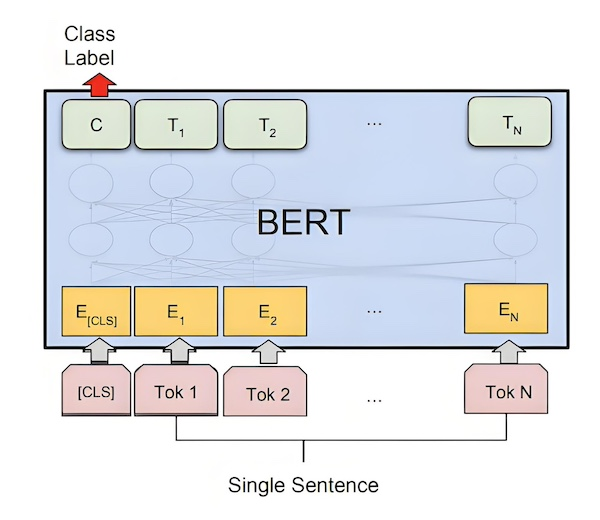
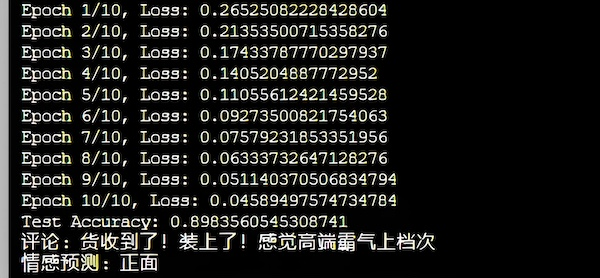

# bert

pytorch实现bert文本分类

## 依赖

项目依赖:
python==3.9
pip3 install torch transformers pandas modelscope

## 网络结构

bert模型网络结构如下，使用中文语料预训练的bert模型tiansz/bert-base-chinese，模型有12层transformer编码器，包含约110万个参数

## 实验效果

