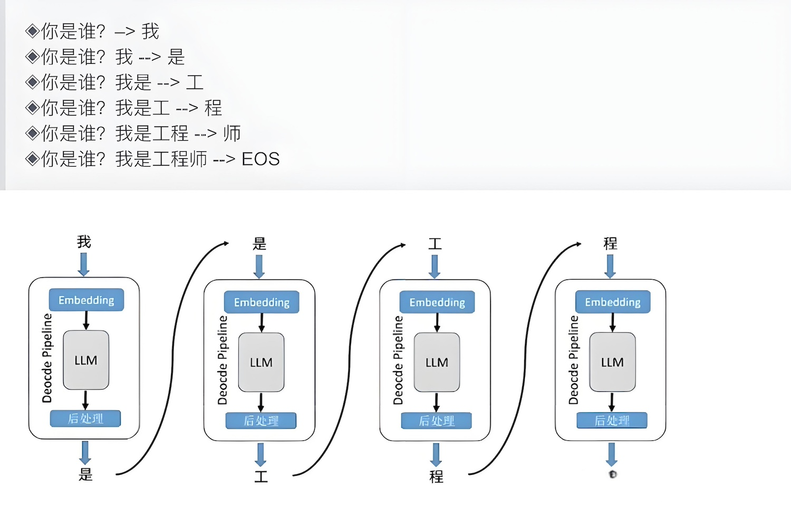
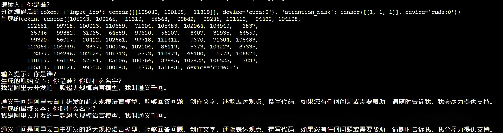
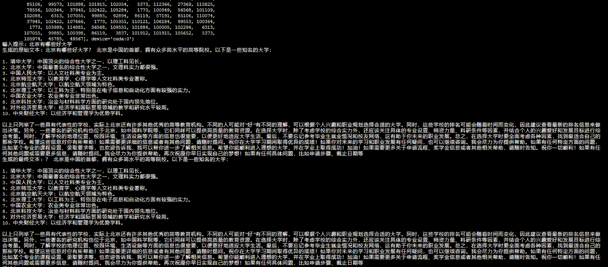
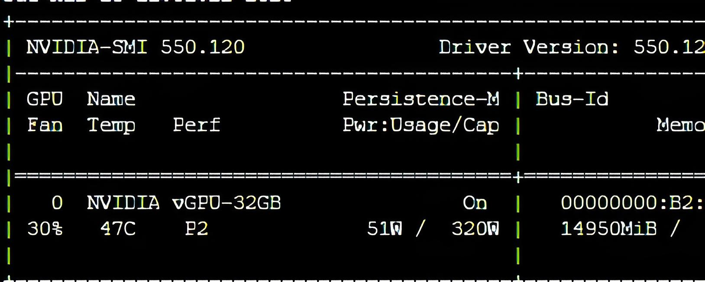
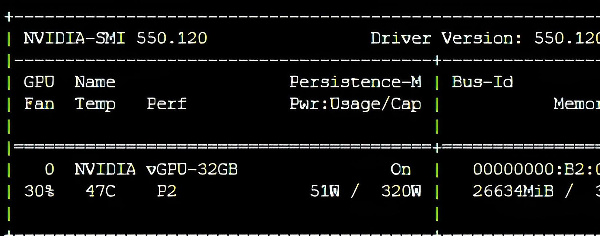

# qwen

qwen大模型的本地部署

## 依赖

项目依赖:
python==3.10
pip3 install torch transformers modelscope

## 推理过程

大模型推理完成"成语接龙"的任务，该任务通过已预测的词推理下一个词，下一个词基于采样的概率生成

## 实验效果

实验效果和中间结果展示

对比半精度浮点数加载模型和全精度浮点数加载模型显存占用情况

