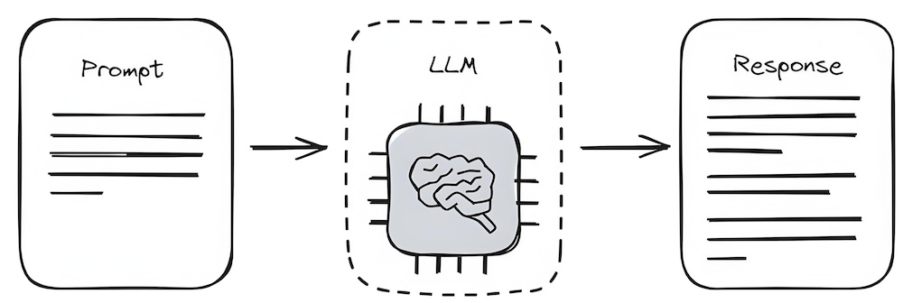
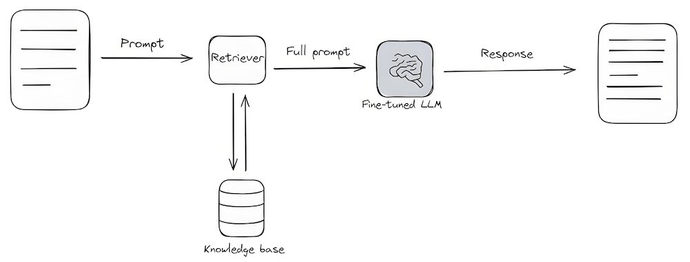
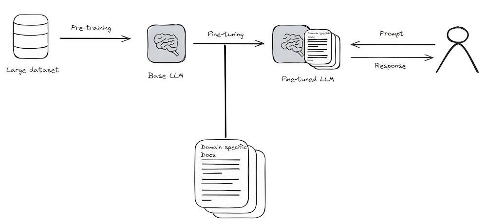
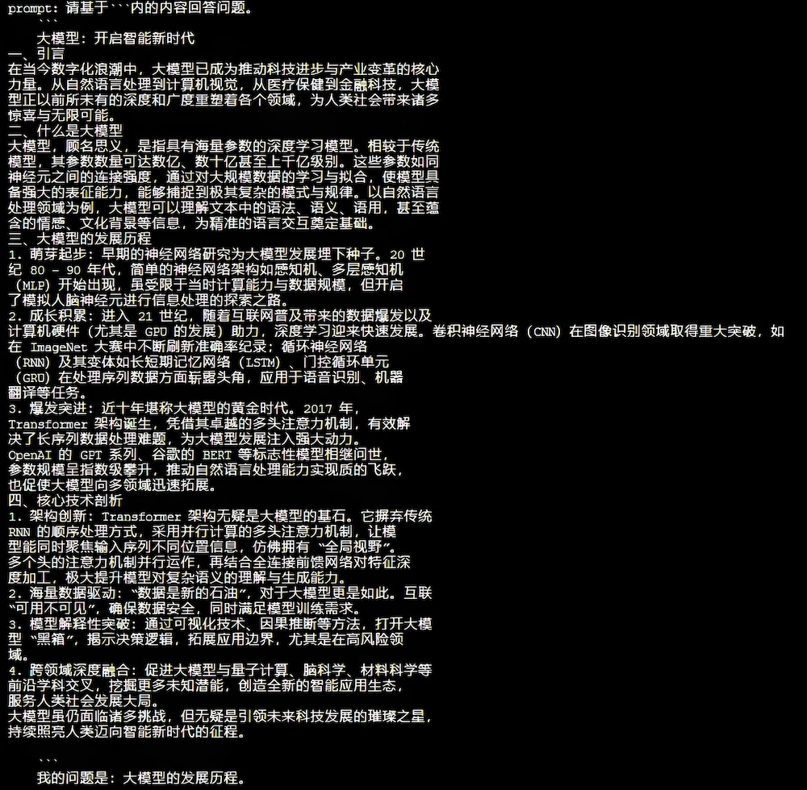
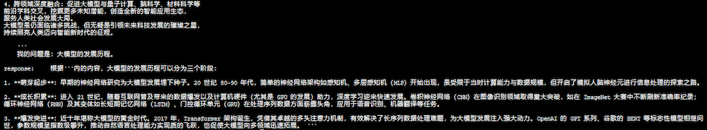

# 检索增强生成

检索增强生成优化大模型的输出

## 依赖

项目依赖:
python==3.10
pip3 install torch transformers modelscope langchain langchain_community pdfplumber faiss

## 大模型输出优化

大模型的输出优化包括：提示词工程(prompt engineering)、检索增强生成(retrieval-augmented generation)
和微调(fine-tuning)三种方式

### 1、提示词工程
通过优化提示词的命令输入来影响大模型的输出，优点：简单易用、使用成本低；
缺点：输出可控性差、过分依赖大模型的能力

### 2、检索增强生成
通过提供内部知识库做检索增强，弥补大模型缺乏领域知识和实效知识的能力，优点：利用外部知识提供相关的信息
增强大模型的能力、使用成本介于提示词工程和微调之间；缺点：效果取决于提供的外部知识库、效果也依赖于向量检索的能力

### 3、微调
通过提供内部数据微调大模型的部分参数，使得模型更加拟合内部的数据，优点：回复准确率高、模型可以适应特定领域和风格；
缺点：使用成本高、数据需求量大

## 实验效果

提示词和中间结果展示

